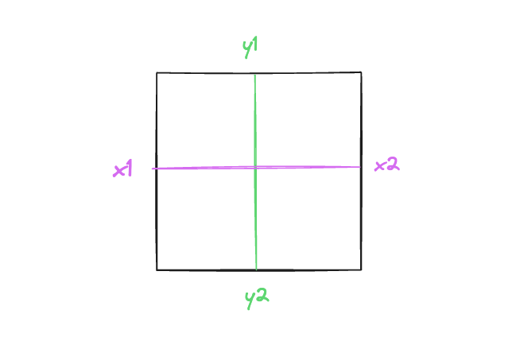
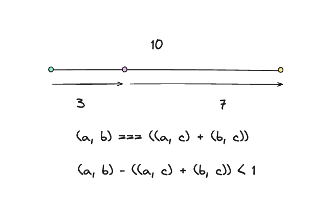

# 🥷🏽 NinjaSketch

An Excalidraw clone with React and TypeScript. Rough.js is used for the sketchy, hand-drawn style. I built the side project for learning purposes. The app is not responsive. I mainly focused on the functionalities since I already have plenty of projects that are responsive.

## 📦 Technologies

- `Vite`
- `React.js`
- `TypeScript`
- `Rough.js`
- `CSS`
- `Cypress`
- `Testing Library`

## 🦄 Features

Here's what you can do with NinjaSketch:

- **Choose a Tool**: You have pencils, lines, rectangles, and text tools. Pick one and start creating.

- **Draw and Move**: Click and drag on the canvas to draw. To move something, select it and drag it to a new spot. Also, resize elements by dragging the corners. Resizing only works on rectangles or lines.

- **Edit Text**: Click on the canvas and start typing to add text to your drawings. You can also edit existing text.

- **Zoom**: Use Ctrl + Scroll or click on the buttons to zoom in for detail or out to see the whole picture.

- **Pan**: Hold the Space bar and drag or use the middle mouse button to move around the whiteboard canvas.

### 🎯 Keyboard Shortcuts:

Speed up your work with these shortcuts:

- **Canvas Navigation**: Press the Space bar and drag or use the middle mouse button.
- **Undo**: Ctrl + Z.
- **Redo**: Ctrl + Y or Ctrl + Shift + Z.
- **Zoom In**: Ctrl + Plus.
- **Zoom Out**: Ctrl + Minus.

## 👩🏽‍🍳 The Process

I started by rendering a canvas with rough.js to create the base for all the drawings. Then, I focused on drawing on the canvas, allowing users to make lines, rectangles, and other shapes.

Next, I made sure users could move elements around. This was important for adjusting drawings. After that, I added the ability to resize elements to give more control over the shapes.

To make sure mistakes could be fixed, I implemented undo and redo features. I also added freehand drawing for a more natural sketching experience and a text tool to label or note on the canvas.

To navigate larger drawings, I put in pan and zoom tools. With everything functioning, I designed the whole UI to make it user-friendly and appealing.

Finally, I added testing with Cypress and Testing Library. I conducted end-to-end tests on drawing and manipulating text, lines, rectangles, and freehand drawings to make sure everything worked smoothly.

Along the way, while building everything, I took notes on what I've learned so I don't miss out on it. I also documented the behind-the-scenes processes every time a feature was added.

This way, I understood what I've built. The funny thing is, as soon as I started to document what happened behind the scenes and the features I've added, it made me realize that we fully understand something once we've actually taken a step back, thought about it, and documented what we've done. I think this is a good practice to follow when learning something new.

## 📚 What I Learned

During this project, I've picked up important skills and a better understanding of complex ideas, which improved my logical thinking.

### 🧠 `useHistory` Hook:

- **Logical Thinking**: Creating the `useHistory` hook taught me to think about how to manage saving, undoing, and redoing actions. I had to really understand how to track changes and plan out user actions.

### 📏 Coordinates and Measurements:

- **Accuracy**: I've become better at working with shapes and points, like knowing if a point is inside a shape. This required careful measurements.
- **Math Skills**: I used math functions to make sure everything was placed correctly and to calculate distances.

### 🎨 Discovering Rough.js:

- **New Tools**: I found out about Rough.js, which lets me make graphics look hand-drawn. This was a new and exciting tool for me.

### 🔍 Deep Dive into Functions:

- **Complex Functions**: I spent time understanding the `getSvgPathFromStroke` function, which turns drawing movements into smooth paths.

### ✏️ Managing Points and Drawing:

- **Working with Points**: I learned how to collect and use points from drawings, which involved understanding and managing data to reflect what the user does.

### 🎣 React Hooks and Rendering:

- **New Knowledge**: I learned about `useLayoutEffect`, which helps make sure changes are done before the screen updates. This was useful for certain drawing functions.

### 🎡 Advanced Event Handling:

- **User Interaction**: I worked with the wheel event listener, which allowed me to add zooming and panning features. This made the app more interactive and user-friendly.

### 📈 Overall Growth:

Each part of this project helped me understand more about building apps, managing complex information, and improving user experience. It was more than just making a tool. It was about solving problems, learning new things, and improving my skills for future work.

## 💭 How can it be improved?

- Add more colors to the color picker.
- Add more tools like a circle, eraser, and more.
- Add more shapes like triangles, stars, and more.
- Add more keyboard shortcuts to make things faster.
- Add more themes like dark mode, light mode, and more.
- Add more text options like font size, font color, and more.
- Instead of have any in two places, create a type for the rough.js elements.

## 🚦 Running the Project

To run the project in your local environment, follow these steps:

1. Clone the repository to your local machine.
2. Run `npm install` or `yarn` in the project directory to install the required dependencies.
3. Run `npm run start` or `yarn start` to get the project started.
4. Open [http://localhost:5173](http://localhost:5173) (or the address shown in your console) in your web browser to view the app.

## 🍿 Video

https://github.com/mirayatech/NinjaSketch/assets/71933266/6a16c9e5-6380-4317-96e7-d132768f7b40

## 🎬 Behind the Scenes: Building NinjaSketch

A step by step guide on how I created this. The code is often changed as I'm always adjusting it for the best results. 🔮

<details> 
<summary><h4> 1️⃣ Rendering canvas with rough.js </h4> </summary>

In the `useLayoutEffect`, I first grab the canvas from the webpage and prepare it for drawing. I'm doing this because I don't want old sketches to mix with the new one, ensuring a clean and clear drawing every time.

It clears any previous drawings to start fresh. Then, I use rough.js to make the drawings look sketchy and hand-drawn.

A rectangle is drawn on this prepared canvas. All of this is done before the browser updates the display, which means the drawing appears all at once.

```javascript
import { useLayoutEffect } from "react";
import rough from "roughjs";

export default function App() {
  useLayoutEffect(() => {
    const canvas = document.getElementById("canvas") as HTMLCanvasElement;
    const context = canvas.getContext("2d") as CanvasRenderingContext2D;
    context.clearRect(0, 0, canvas.width, canvas.height);

    const roughCanvas = rough.canvas(canvas);
    const rect = roughCanvas.rectangle(10, 10, 200, 200);
    roughCanvas.draw(rect);
  });

  return (
    <div>
      <canvas id="canvas" width={window.innerWidth} height={window.innerHeight}>
        Canvas
      </canvas>
    </div>
  );
}
```

</details>
<details>
<summary><h4>2️⃣ Drawing the canvas</h4> </summary>

When I press the mouse down, the `handleMouseDown` function activates. It indicates I'm starting to draw by setting the `drawing` state to true. This means I'm beginning a new shape right where my cursor is at. The shape I draw, a line or rectangle, is decided by my previous choice and tracked by the `elementType` state, and the radio buttons let me switch between lines and rectangles.

While I move the mouse, the `handleMouseMove` function activates. If I'm drawing, the shape follows my cursor.

On the technical side, I find the last drawing I started with `const index = elements.length - 1;`. I then capture my mouse's current position with `const { clientX, clientY } = event;`. The `const { x1, y1 } = elements[index];` gets the starting point of my current shape, basically marking the first corner or line end. Using the initial and current positions, I update the shape I'm drawing with `const updateElement = createElement(x1, y1, clientX, clientY);`. Next, I make a copy of all my drawings and update the most recent one, the shape I'm currently changing, with the new version. This updated collection is then saved back into the `elements` state.

The drawing stops when I release the mouse, which the `handleMouseUp` function handles, ending the drawing.

I store every stroke and shape in an array, which is the `elements` state, and `useLayoutEffect` redraws the canvas with each new addition.

The clear button empties the array for a fresh canvas.

```javascript
import { MouseEvent, useLayoutEffect, useState } from "react";
import rough from "roughjs";

type ElementType = {
  x1: number;
  y1: number;
  x2: number;
  y2: number;
  // TODO: add type
  // eslint-disable-next-line @typescript-eslint/no-explicit-any
  roughElement: any;
};

export default function App() {
  const [elements, setElements] = useState<ElementType[]>([]);
  const [drawing, setDrawing] = useState(false);
  const [elementType, setElementType] = useState<"line" | "rectangle">("line");

  const generator = rough.generator();

  const createElement = (
    x1: number,
    y1: number,
    x2: number,
    y2: number
  ): ElementType => {
    const roughElement =
      elementType === "line"
        ? generator.line(x1, y1, x2, y2)
        : generator.rectangle(x1, y1, x2 - x1, y2 - y1);
    return { x1, y1, x2, y2, roughElement };
  };

  useLayoutEffect(() => {
    const canvas = document.getElementById("canvas") as HTMLCanvasElement;
    const context = canvas.getContext("2d") as CanvasRenderingContext2D;
    context.clearRect(0, 0, canvas.width, canvas.height);
    const roughCanvas = rough.canvas(canvas);
    elements.forEach(({ roughElement }) => {
      roughCanvas.draw(roughElement);
    });
  }, [elements]);

  const handleMouseDown = (event: MouseEvent<HTMLCanvasElement>) => {
    setDrawing(true);
    const { clientX, clientY } = event;
    const element = createElement(clientX, clientY, clientX, clientY);
    setElements((prevState) => [...prevState, element]);
  };

  const handleMouseMove = (event: MouseEvent<HTMLCanvasElement>) => {
    if (!drawing) {
      return;
    }
    const index = elements.length - 1;
    const { clientX, clientY } = event;
    const { x1, y1 } = elements[index];
    const updateElement = createElement(x1, y1, clientX, clientY);
    const elementsCopy = [...elements];
    elementsCopy[index] = updateElement;
    setElements(elementsCopy);
  };

  const handleMouseUp = () => {
    setDrawing(false);
  };
  return (
    <div>
      <div style={{ position: "fixed" }}>
        <button onClick={() => setElements([])}>Clear</button>
        <input
          type="radio"
          name="line"
          id="line"
          checked={elementType === "line"}
          onChange={() => setElementType("line")}
        />
        <label htmlFor="line">line</label>
        <input
          type="radio"
          name="rectangle"
          id="rectangle"
          checked={elementType === "rectangle"}
          onChange={() => setElementType("rectangle")}
        />
        <label htmlFor="rectangle">rectangle</label>
      </div>
      <canvas
        id="canvas"
        width={window.innerWidth}
        height={window.innerHeight}
        onMouseDown={handleMouseDown}
        onMouseUp={handleMouseUp}
        onMouseMove={handleMouseMove}
      >
        Canvas
      </canvas>
    </div>
  );
}
```

</details>

<details>
<summary><h4>3️⃣ Moving Elements</h4></summary>

I've renamed `elementType` and `setElementType` to `tools` and `setTools` to make it clearer. Now, I pick from different tools using radio buttons, not just setting an element type.

I've renamed `setDrawing` and `drawing` to `setAction` and `action` for more generic use. Now, I can do things like move elements if the tool is `selection` and the action is `moving`. This lets me move what I've drawn, making it more interactive.

An enum for `Tools` has been created, making it clearer and more organized to switch between "selection", "line", and "rectangle" tools.

`getElementAtPosition` finds the element at the cursors position, so I know which shape you're trying to move.

`isWithinElement` function figures out if I can move a shape with my cursor.

For rectangles, it checks if the cursor is inside the shapes edges like this:

```javascript
if (type === Tools.Rectangle) {
  const minX = Math.min(x1, x2);
  const maxX = Math.max(x1, x2);
  const minY = Math.min(y1, y2);
  const maxY = Math.max(y1, y2);
  return x >= minX && x <= maxX && y >= minY && y <= maxY;
}
```



For lines, it checks if the cursor is close to the line by measuring distances:

```javascript
else {
  const a = { x: x1, y: y1 };
  const b = { x: x2, y: y2 };
  const c = { x, y };
  const offset = distance(a, b) - (distance(a, c) + distance(b, c));
  return Math.abs(offset) < 1;
}
```



So if the cursor is almost as far from the lines ends as the line is long, it's "on" the line.

I learned the line method from [stack overflow](https://stackoverflow.com/questions/17692922/check-is-a-point-x-y-is-between-two-points-drawn-on-a-straight-line/17693146#17693146).

The `distance` function just helps me find out how far apart two points are.

```javascript
import { MouseEvent, useLayoutEffect, useState } from "react";
import rough from "roughjs";

type ElementType = {
  id: number;
  x1: number;
  y1: number;
  x2: number;
  y2: number;
  type: Tools;
  // TODO: add type
  // eslint-disable-next-line @typescript-eslint/no-explicit-any
  roughElement: any;
  offsetX?: number;
  offsetY?: number;
};

enum Tools {
  Selection = "selection",
  Line = "line",
  Rectangle = "rectangle",
}

export default function App() {
  const [elements, setElements] = useState<ElementType[]>([]);
  const [action, setAction] = useState("none");
  const [tool, setTool] = useState<Tools>(Tools.Line);
  const [selectedElement, setSelectedElement] = useState<ElementType | null>();
  const generator = rough.generator();

  const createElement = (
    id: number,
    x1: number,
    y1: number,
    x2: number,
    y2: number,
    type: Tools
  ): ElementType => {
    const roughElement =
      type === Tools.Line
        ? generator.line(x1, y1, x2, y2)
        : generator.rectangle(x1, y1, x2 - x1, y2 - y1);
    return { id, x1, y1, x2, y2, type, roughElement };
  };

  type PointType = { x: number; y: number };

  const distance = (a: PointType, b: PointType) =>
    Math.sqrt(Math.pow(a.x - b.x, 2) + Math.pow(a.y - b.y, 2));

  const isWithinElement = (x: number, y: number, element: ElementType) => {
    const { type, x1, y1, x2, y2 } = element;

    if (type === Tools.Rectangle) {
      const minX = Math.min(x1, x2);
      const maxX = Math.max(x1, x2);
      const minY = Math.min(y1, y2);
      const maxY = Math.max(y1, y2);
      return x >= minX && x <= maxX && y >= minY && y <= maxY;
    } else {
      const a = { x: x1, y: y1 };
      const b = { x: x2, y: y2 };
      const c = { x, y };
      const offset = distance(a, b) - (distance(a, c) + distance(b, c));
      return Math.abs(offset) < 1;
    }
  };

  const getElementAtPosition = (
    x: number,
    y: number,
    elements: ElementType[]
  ) => {
    return elements.find((element) => isWithinElement(x, y, element));
  };

  useLayoutEffect(() => {
    const canvas = document.getElementById("canvas") as HTMLCanvasElement;
    const context = canvas.getContext("2d") as CanvasRenderingContext2D;
    context.clearRect(0, 0, canvas.width, canvas.height);

    const roughCanvas = rough.canvas(canvas);

    elements.forEach(({ roughElement }) => {
      roughCanvas.draw(roughElement);
    });
  }, [elements]);

  const updateElement = (
    id: number,
    x1: number,
    y1: number,
    x2: number,
    y2: number,
    type: Tools
  ) => {
    const updateElement = createElement(id, x1, y1, x2, y2, type);

    const elementsCopy = [...elements];
    elementsCopy[id] = updateElement;
    setElements(elementsCopy);
  };

  const handleMouseDown = (event: MouseEvent<HTMLCanvasElement>) => {
    const { clientX, clientY } = event;

    if (tool === Tools.Selection) {
      const element = getElementAtPosition(clientX, clientY, elements);
      if (element) {
        const offsetX = clientX - element.x1;
        const offsetY = clientY - element.y1;
        setSelectedElement({ ...element, offsetX, offsetY });
        setAction("moving");
      }
    } else {
      const id = elements.length;
      const element = createElement(
        id,
        clientX,
        clientY,
        clientX,
        clientY,
        tool
      );
      setElements((prevState) => [...prevState, element]);
      setAction("drawing");
    }
  };

  const handleMouseMove = (event: MouseEvent<HTMLCanvasElement>) => {
    const { clientX, clientY } = event;

    if (tool === Tools.Selection) {
      (event.target as HTMLElement).style.cursor = getElementAtPosition(
        clientX,
        clientY,
        elements
      )
        ? "move"
        : "default";
    }

    if (action === "drawing") {
      const index = elements.length - 1;
      const { x1, y1 } = elements[index];
      updateElement(index, x1, y1, clientX, clientY, tool);
    } else if (action === "moving" && selectedElement) {
      const { id, x1, x2, y1, y2, type, offsetX, offsetY } = selectedElement;
      const safeOffsetX = offsetX ?? 0;
      const safeOffsetY = offsetY ?? 0;
      const newX1 = clientX - safeOffsetX;
      const newY1 = clientY - safeOffsetY;
      // 🫐 Calculate the new position for x2 and y2 based on the original size
      const newX2 = newX1 + (x2 - x1);
      const newY2 = newY1 + (y2 - y1);

      updateElement(id, newX1, newY1, newX2, newY2, type);
    }
  };

  const handleMouseUp = () => {
    setAction("none");
  };

  return (
    <div>
      <div style={{ position: "fixed" }}>
        <button onClick={() => setElements([])}>Clear</button>

        <input
          type="radio"
          name="selection"
          id="selection"
          checked={tool === Tools.Selection}
          onChange={() => setTool(Tools.Selection)}
        />
        <label htmlFor="selection">selection</label>
        <input
          type="radio"
          name="line"
          id="line"
          checked={tool === Tools.Line}
          onChange={() => setTool(Tools.Line)}
        />
        <label htmlFor="line">line</label>

        <input
          type="radio"
          name="rectangle"
          id="rectangle"
          checked={tool === Tools.Rectangle}
          onChange={() => setTool(Tools.Rectangle)}
        />

        <label htmlFor="rectangle">rectangle</label>
      </div>
      <canvas
        id="canvas"
        width={window.innerWidth}
        height={window.innerHeight}
        onMouseDown={handleMouseDown}
        onMouseUp={handleMouseUp}
        onMouseMove={handleMouseMove}
      >
        Canvas
      </canvas>
    </div>
  );
}
```

</details>

<details>
<summary><h4>4️⃣ Resizing Elements </h4></summary>

`cursorForPosition` figures out which cursor to show when I'm hovering over an element. For example, if I'm hovering over the top left corner of a rectangle, I want to show the "nwse-resize" cursor.

`resizedCoordinates` calculates the new coordinates for the element I'm resizing. It takes the original coordinates and the current cursor position and returns the new coordinates.

`adjustElementCoordinates` makes sure the coordinates are in the right order. For example, if I draw a rectangle from the bottom right to the top left, the coordinates are in the wrong order. This function fixes that.

I renamed `isWithinElement` to `positionWithinElement` because it's more accurate. It figures out where I'm hovering over an element. It returns a string like "topLeft", "bottomRight", or "inside". This helps me know where to resize the element.

`getElementAtPosition` is updated to include the position of the element I'm hovering over.

`handleMouseMove` is updated to resize the element if I'm hovering over it and the action is `resizing`.

`handleMouseDown` is updated to set the action to `resizing` if I'm hovering over an element.

`handleMouseUp` is updated to set the action to `none` if I'm hovering over an element.

```javascript
import { MouseEvent, useLayoutEffect, useState } from "react";
import rough from "roughjs";

type ElementType = {
  id: number;
  x1: number;
  y1: number;
  x2: number;
  y2: number;
  type: Tools;
  // TODO: add type
  // eslint-disable-next-line @typescript-eslint/no-explicit-any
  roughElement: any;
  offsetX?: number;
  offsetY?: number;
  position?: string | null;
};

enum Tools {
  Selection = "selection",
  Line = "line",
  Rectangle = "rectangle",
}

export default function App() {
  const [elements, setElements] = useState<ElementType[]>([]);
  const [action, setAction] = useState("none");
  const [tool, setTool] = useState<Tools>(Tools.Line);
  const [selectedElement, setSelectedElement] = useState<ElementType | null>();
  const generator = rough.generator();

  const cursorForPosition = (position: string) => {
    switch (position) {
      case "topLeft":
      case "bottomRight":
        return "nwse-resize";
      case "topRight":
      case "bottomLeft":
        return "nesw-resize";
      case "start":
      case "end":
        return "move";
      case "inside":
        return "move";
      default:
        return "default";
    }
  };

  const resizedCoordinates = (
    clientX: number,
    clientY: number,
    position: string,
    coordinates: { x1: number; y1: number; x2: number; y2: number }
  ) => {
    const { x1, y1, x2, y2 } = coordinates;

    switch (position) {
      case "start":
      case "topLeft":
        return {
          x1: clientX,
          y1: clientY,
          x2,
          y2,
        };
      case "topRight":
        return {
          x1,
          y1: clientY,
          x2: clientX,
          y2,
        };
      case "bottomLeft":
        return {
          x1: clientX,
          y1,
          x2,
          y2: clientY,
        };
      case "end":
      case "bottomRight":
        return {
          x1,
          y1,
          x2: clientX,
          y2: clientY,
        };
      default:
        return coordinates;
    }
  };

  const createElement = (
    id: number,
    x1: number,
    y1: number,
    x2: number,
    y2: number,
    type: Tools
  ): ElementType => {
    const roughElement =
      type === Tools.Line
        ? generator.line(x1, y1, x2, y2)
        : generator.rectangle(x1, y1, x2 - x1, y2 - y1);
    return { id, x1, y1, x2, y2, type, roughElement };
  };

  type PointType = { x: number; y: number };

  const distance = (a: PointType, b: PointType) =>
    Math.sqrt(Math.pow(a.x - b.x, 2) + Math.pow(a.y - b.y, 2));

  const nearPoint = (
    x: number,
    y: number,
    x1: number,
    y1: number,
    name: string
  ) => {
    return Math.abs(x - x1) < 5 && Math.abs(y - y1) < 5 ? name : null;
  };

  const positionWithinElement = (
    x: number,
    y: number,
    element: ElementType
  ) => {
    const { type, x1, y1, x2, y2 } = element;

    if (type === Tools.Rectangle) {
      const topLeft = nearPoint(x, y, x1, y1, "topLeft");
      const topRight = nearPoint(x, y, x2, y1, "topRight");
      const bottomLeft = nearPoint(x, y, x1, y2, "bottomLeft");
      const bottomRight = nearPoint(x, y, x2, y2, "bottomRight");
      const inside = x >= x1 && x <= x2 && y >= y1 && y <= y2 ? "inside" : null;
      return topLeft || topRight || bottomLeft || bottomRight || inside;
    } else {
      const a = { x: x1, y: y1 };
      const b = { x: x2, y: y2 };
      const c = { x, y };
      const offset = distance(a, b) - (distance(a, c) + distance(b, c));
      const start = nearPoint(x, y, x1, y1, "start");
      const end = nearPoint(x, y, x2, y2, "end");
      const inside = Math.abs(offset) < 1 ? "inside" : null;
      return start || end || inside;
    }
  };

  const adjustElementCoordinates = (element: ElementType) => {
    const { type, x1, y1, x2, y2 } = element;

    if (type === Tools.Rectangle) {
      const minX = Math.min(x1, x2);
      const maxX = Math.max(x1, x2);
      const minY = Math.min(y1, y2);
      const maxY = Math.max(y1, y2);
      return { x1: minX, y1: minY, x2: maxX, y2: maxY };
    } else {
      if (x1 < x2 || (x1 === x2 && y1 < y2)) {
        return { x1, y1, x2, y2 };
      } else {
        return { x1: x2, y1: y2, x2: x1, y2: y1 };
      }
    }
  };

  const getElementAtPosition = (
    x: number,
    y: number,
    elements: ElementType[]
  ) => {
    return elements
      .map((element) => ({
        ...element,
        position: positionWithinElement(x, y, element),
      }))
      .find((element) => element.position !== null);
  };

  useLayoutEffect(() => {
    const canvas = document.getElementById("canvas") as HTMLCanvasElement;
    const context = canvas.getContext("2d") as CanvasRenderingContext2D;
    context.clearRect(0, 0, canvas.width, canvas.height);

    const roughCanvas = rough.canvas(canvas);

    elements.forEach(({ roughElement }) => {
      roughCanvas.draw(roughElement);
    });
  }, [elements]);

  const updateElement = (
    id: number,
    x1: number,
    y1: number,
    x2: number,
    y2: number,
    type: Tools
  ) => {
    const updateElement = createElement(id, x1, y1, x2, y2, type);

    const elementsCopy = [...elements];
    elementsCopy[id] = updateElement;
    setElements(elementsCopy);
  };

  const handleMouseDown = (event: MouseEvent<HTMLCanvasElement>) => {
    const { clientX, clientY } = event;

    if (tool === Tools.Selection) {
      const element = getElementAtPosition(clientX, clientY, elements);
      if (element) {
        const offsetX = clientX - element.x1;
        const offsetY = clientY - element.y1;
        setSelectedElement({ ...element, offsetX, offsetY });

        if (element.position === "inside") {
          setAction("moving");
        } else {
          setAction("resizing");
        }
      }
    } else {
      const id = elements.length;
      const element = createElement(
        id,
        clientX,
        clientY,
        clientX,
        clientY,
        tool
      );
      setElements((prevState) => [...prevState, element]);
      setSelectedElement(element);
      setAction("drawing");
    }
  };

  const handleMouseMove = (event: MouseEvent<HTMLCanvasElement>) => {
    const { clientX, clientY } = event;

    if (tool === Tools.Selection) {
      const element = getElementAtPosition(clientX, clientY, elements);

      if (element && element.position) {
        (event.target as HTMLElement).style.cursor = cursorForPosition(
          element.position
        );
      } else {
        (event.target as HTMLElement).style.cursor = "default";
      }
    }

    if (action === "drawing") {
      const index = elements.length - 1;
      const { x1, y1 } = elements[index];
      updateElement(index, x1, y1, clientX, clientY, tool);
    } else if (action === "moving" && selectedElement) {
      const { id, x1, x2, y1, y2, type, offsetX, offsetY } = selectedElement;
      const safeOffsetX = offsetX ?? 0;
      const safeOffsetY = offsetY ?? 0;
      const newX1 = clientX - safeOffsetX;
      const newY1 = clientY - safeOffsetY;
      // 🫐 Calculate the new position for x2 and y2 based on the original size
      const newX2 = newX1 + (x2 - x1);
      const newY2 = newY1 + (y2 - y1);

      updateElement(id, newX1, newY1, newX2, newY2, type);
    } else if (
      action === "resizing" &&
      selectedElement &&
      selectedElement.position
    ) {
      const { id, type, position, ...coordinates } = selectedElement;

      const { x1, y1, x2, y2 } = resizedCoordinates(
        clientX,
        clientY,
        position,
        coordinates
      );
      updateElement(id, x1, y1, x2, y2, type);
    }
  };

  const handleMouseUp = () => {
    if (action === "drawing" || action === "resizing") {
      if (selectedElement) {
        const index = selectedElement.id;
        const { id, type } = elements[index];
        const { x1, y1, x2, y2 } = adjustElementCoordinates(elements[index]);
        updateElement(id, x1, y1, x2, y2, type);
      }
    }

    setAction("none");
  };

  return (
    <div>
      <div style={{ position: "fixed" }}>
        <button onClick={() => setElements([])}>Clear</button>

        <input
          type="radio"
          name="selection"
          id="selection"
          checked={tool === Tools.Selection}
          onChange={() => setTool(Tools.Selection)}
        />
        <label htmlFor="selection">selection</label>
        <input
          type="radio"
          name="line"
          id="line"
          checked={tool === Tools.Line}
          onChange={() => setTool(Tools.Line)}
        />
        <label htmlFor="line">line</label>

        <input
          type="radio"
          name="rectangle"
          id="rectangle"
          checked={tool === Tools.Rectangle}
          onChange={() => setTool(Tools.Rectangle)}
        />

        <label htmlFor="rectangle">rectangle</label>
      </div>
      <canvas
        id="canvas"
        width={window.innerWidth}
        height={window.innerHeight}
        onMouseDown={handleMouseDown}
        onMouseUp={handleMouseUp}
        onMouseMove={handleMouseMove}
      >
        Canvas
      </canvas>
    </div>
  );
}

```

</details>

<details>
<summary><h4>5️⃣ Undo & Redo Elements</h4></summary>

I created a hook called `useHistory` to keep track of the elements I've drawn.

The `history` is an array of all the elements I've drawn. The `index` is the current element I'm on.

The `setElements` function is a wrapper around the `setState` function. It lets me update the current element or add a new one. The `undo` function goes back one element in the `history` array. The `redo` function goes forward one element in the `history` array.

That way I can undo and redo my drawings and making sure I don't lose any work.

```javascript
import { useState } from "react";
import { ElementType } from "./App";

export const useHistory = (initialState: ElementType[]) => {
  const [index, setIndex] = useState(0);
  const [history, setHistory] = useState([initialState]);

  const setState = (
    action: ElementType[] | ((current: ElementType[]) => ElementType[]),
    overwrite = false
  ) => {
    const newState =
      typeof action === "function" ? action(history[index]) : action;
    if (overwrite) {
      const historyCopy = [...history];
      historyCopy[index] = newState;
      setHistory(historyCopy);
    } else {
      const updatedState = [...history].slice(0, index + 1);
      setHistory([...updatedState, newState]);
      setIndex((prevState) => prevState + 1);
    }
  };

  const undo = () => index > 0 && setIndex((prevState) => prevState - 1);
  const redo = () =>
    index < history.length - 1 && setIndex((prevState) => prevState + 1);

  return {
    elements: history[index],
    setElements: setState,
    undo,
    redo,
  };
};
```

In the `useEffect` hook, I listen for the `ctrl+z` and `ctrl+shift+z` keyboard shortcuts. If I press `ctrl+z`, I undo. If I press `ctrl+y`, I redo.

```javascript
useEffect(() => {
  const undoRedoFunction = (event: KeyboardEvent) => {
    if (event.ctrlKey || event.metaKey) {
      if (event.key === "z") {
        if (event.shiftKey) {
          redo();
        } else {
          undo();
        }
      } else if (event.key === "y") {
        redo();
      }
    }
  };

  document.addEventListener("keydown", undoRedoFunction);
  return () => {
    document.removeEventListener("keydown", undoRedoFunction);
  };
}, [undo, redo]);
```

</details>

<details>
<summary><h4>6️⃣ Freehand Drawing</h4></summary>

I've added the `Pencil` tool for freehand drawing. In the `Tools` enum, `Pencil` has also been added.

Also I've replaced several conditional statements with switch cases to enhance readability, especially as more tools have been added.

Once I pick the `Pencil` tool and press the mouse, I start tracing a path that the app records. My movements are captured by the `handleMouseDown` and `handleMouseMove` functions, which gather all the points and sketch out the path I'm drawing.

To render the freehand drawing smoothly, I used the `getStroke` function from `perfect-freehand`, which converts the array of points into a smooth stroke path. The `drawElement` function was also updated to handle the new pencil strokes and render them on the canvas.

`drawElement` function was also updated to handle the new pencil strokes and render them on the canvas. In the `"pencil"` case of the switch statement, I use the `getStroke` function from `perfect-freehand` to convert the array of points into a smooth stroke path. Then I use the `getSvgPathFromStroke` function to convert the stroke into an SVG path. Finally, I use the `Path2D` constructor to create a new path and fill it with the SVG path.

```javascript
const drawElement = (
  // TODO: add type
  // eslint-disable-next-line @typescript-eslint/no-explicit-any
  roughCanvas: any,
  context: CanvasRenderingContext2D,
  element: ElementType
) => {
  switch (element.type) {
    case "line":
    case "rectangle":
      roughCanvas.draw(element.roughElement);
      break;
    case "pencil": {
      if (!element.points) {
        throw new Error("Pencil element points are undefined");
      }
      const strokePoints = getStroke(element.points);
      const formattedPoints: [number, number][] = strokePoints.map((point) => {
        if (point.length !== 2) {
          throw new Error(
            `Expected point to have exactly 2 elements, got ${point.length}`
          );
        }
        return [point[0], point[1]];
      });
      const stroke = getSvgPathFromStroke(formattedPoints);
      context.fill(new Path2D(stroke));
      break;
    }
    default:
      throw new Error(`Type not recognised: ${element.type}`);
  }
};
```

`getSvgPathFromStroke` function converts the stroke into an SVG path. It takes an array of points and returns an SVG path. I got the function from [this page](https://www.npmjs.com/package/perfect-freehand/v/1.0.4).

```javascript
const getSvgPathFromStroke = (stroke: [number, number][]) => {
  if (!stroke.length) return "";

  const d = stroke.reduce(
    (
      acc: string[],
      [x0, y0]: [number, number],
      i: number,
      arr: [number, number][]
    ) => {
      const [x1, y1] = arr[(i + 1) % arr.length];
      acc.push(
        x0.toString(),
        y0.toString(),
        ((x0 + x1) / 2).toString(),
        ((y0 + y1) / 2).toString()
      );
      return acc;
    },
    ["M", ...stroke[0].map((num) => num.toString()), "Q"]
  );

  d.push("Z");
  return d.join(" ");
};
```

The freehand drawings are integrated with the undo/redo functionality. Each stroke is treated as an individual element, so I can easily backtrack or redo my freehand drawings.

A radio button for the pencil tool has been added to the tool selection area for easy access. I can now switch between different modes, including the new freehand drawing mode.

```javascript
 import { MouseEvent, useEffect, useLayoutEffect, useState } from "react";
import rough from "roughjs";
import getStroke from "perfect-freehand";
import { useHistory } from "./useHistory";

type SelectedElementType = ElementType & {
  xOffsets?: number[];
  yOffsets?: number[];
  offsetX?: number;
  offsetY?: number;
};
interface ExtendedElementType extends ElementType {
  xOffsets?: number[];
  yOffsets?: number[];
}
export type ElementType = {
  id: number;
  x1: number;
  y1: number;
  x2: number;
  y2: number;
  type: Tools;
  // TODO: add type
  // eslint-disable-next-line @typescript-eslint/no-explicit-any
  roughElement: any;
  offsetX?: number;
  offsetY?: number;
  position?: string | null;
  points?: { x: number; y: number }[];
};

enum Tools {
  Pencil = "pencil",
  Line = "line",
  Rectangle = "rectangle",
  Selection = "selection",
}

export default function App() {
  const { elements, setElements, undo, redo } = useHistory([]);
  const [action, setAction] = useState("none");
  const [tool, setTool] = useState<Tools>(Tools.Line);
  const [selectedElement, setSelectedElement] = useState<ElementType | null>();
  const generator = rough.generator();

  const cursorForPosition = (position: string) => {
    switch (position) {
      case "topLeft":
      case "bottomRight":
        return "nwse-resize";
      case "topRight":
      case "bottomLeft":
        return "nesw-resize";
      case "start":
      case "end":
        return "move";
      case "inside":
        return "move";
      default:
        return "default";
    }
  };

  const resizedCoordinates = (
    clientX: number,
    clientY: number,
    position: string,
    coordinates: { x1: number; y1: number; x2: number; y2: number }
  ) => {
    const { x1, y1, x2, y2 } = coordinates;

    switch (position) {
      case "start":
      case "topLeft":
        return {
          x1: clientX,
          y1: clientY,
          x2,
          y2,
        };
      case "topRight":
        return {
          x1,
          y1: clientY,
          x2: clientX,
          y2,
        };
      case "bottomLeft":
        return {
          x1: clientX,
          y1,
          x2,
          y2: clientY,
        };
      case "end":
      case "bottomRight":
        return {
          x1,
          y1,
          x2: clientX,
          y2: clientY,
        };
      default:
        return coordinates;
    }
  };

  const createElement = (
    id: number,
    x1: number,
    y1: number,
    x2: number,
    y2: number,
    type: Tools
  ): ElementType => {
    switch (type) {
      case Tools.Line:
      case Tools.Rectangle: {
        const roughElement =
          type === Tools.Line
            ? generator.line(x1, y1, x2, y2)
            : generator.rectangle(x1, y1, x2 - x1, y2 - y1);
        return { id, x1, y1, x2, y2, type, roughElement };
      }
      case Tools.Pencil: {
        const defaultRoughElement = null;
        return {
          id,
          x1: 0,
          y1: 0,
          x2: 0,
          y2: 0,
          type,
          points: [{ x: x1, y: y1 }],
          roughElement: defaultRoughElement,
        };
      }
      default:
        throw new Error(`Type not recognised: ${type}`);
    }
  };

  type PointType = { x: number; y: number };

  const distance = (a: PointType, b: PointType) =>
    Math.sqrt(Math.pow(a.x - b.x, 2) + Math.pow(a.y - b.y, 2));

  const nearPoint = (
    x: number,
    y: number,
    x1: number,
    y1: number,
    name: string
  ) => {
    return Math.abs(x - x1) < 5 && Math.abs(y - y1) < 5 ? name : null;
  };

  const onLine = (
    x1: number,
    y1: number,
    x2: number,
    y2: number,
    x: number,
    y: number,
    maxDistance: number = 1
  ): string | null => {
    const a: PointType = { x: x1, y: y1 };
    const b: PointType = { x: x2, y: y2 };
    const c: PointType = { x, y };
    const offset = distance(a, b) - (distance(a, c) + distance(b, c));
    return Math.abs(offset) < maxDistance ? "inside" : null;
  };

  const positionWithinElement = (
    x: number,
    y: number,
    element: ElementType
  ) => {
    const { type, x1, x2, y1, y2 } = element;
    switch (type) {
      case Tools.Line: {
        const on = onLine(x1, y1, x2, y2, x, y);
        const start = nearPoint(x, y, x1, y1, "start");
        const end = nearPoint(x, y, x2, y2, "end");
        return start || end || on;
      }
      case Tools.Rectangle: {
        const topLeft = nearPoint(x, y, x1, y1, "topLeft");
        const topRight = nearPoint(x, y, x2, y1, "topRight");
        const bottomLeft = nearPoint(x, y, x1, y2, "bottomLeft");
        const bottomRight = nearPoint(x, y, x2, y2, "bottomRight");
        const inside =
          x >= x1 && x <= x2 && y >= y1 && y <= y2 ? "inside" : null;
        return topLeft || topRight || bottomLeft || bottomRight || inside;
      }
      case Tools.Pencil: {
        const betweenAnyPoint = element.points!.some((point, index) => {
          const nextPoint = element.points![index + 1];
          if (!nextPoint) return false;
          return (
            onLine(point.x, point.y, nextPoint.x, nextPoint.y, x, y, 5) != null
          );
        });
        return betweenAnyPoint ? "inside" : null;
      }
      default:
        throw new Error(`Type not recognised: ${type}`);
    }
  };

  const adjustElementCoordinates = (element: ElementType) => {
    const { type, x1, y1, x2, y2 } = element;

    if (type === Tools.Rectangle) {
      const minX = Math.min(x1, x2);
      const maxX = Math.max(x1, x2);
      const minY = Math.min(y1, y2);
      const maxY = Math.max(y1, y2);
      return { x1: minX, y1: minY, x2: maxX, y2: maxY };
    } else {
      if (x1 < x2 || (x1 === x2 && y1 < y2)) {
        return { x1, y1, x2, y2 };
      } else {
        return { x1: x2, y1: y2, x2: x1, y2: y1 };
      }
    }
  };

  const getElementAtPosition = (
    x: number,
    y: number,
    elements: ElementType[]
  ) => {
    return elements
      .map((element) => ({
        ...element,
        position: positionWithinElement(x, y, element),
      }))
      .find((element) => element.position !== null);
  };

  const getSvgPathFromStroke = (stroke: [number, number][]) => {
    if (!stroke.length) return "";

    const d = stroke.reduce(
      (
        acc: string[],
        [x0, y0]: [number, number],
        i: number,
        arr: [number, number][]
      ) => {
        const [x1, y1] = arr[(i + 1) % arr.length];
        acc.push(
          x0.toString(),
          y0.toString(),
          ((x0 + x1) / 2).toString(),
          ((y0 + y1) / 2).toString()
        );
        return acc;
      },
      ["M", ...stroke[0].map((num) => num.toString()), "Q"]
    );

    d.push("Z");
    return d.join(" ");
  };

  const drawElement = (
    // TODO: add type
    // eslint-disable-next-line @typescript-eslint/no-explicit-any
    roughCanvas: any,
    context: CanvasRenderingContext2D,
    element: ElementType
  ) => {
    switch (element.type) {
      case "line":
      case "rectangle":
        roughCanvas.draw(element.roughElement);
        break;
      case "pencil": {
        if (!element.points) {
          throw new Error("Pencil element points are undefined");
        }
        const strokePoints = getStroke(element.points);
        const formattedPoints: [number, number][] = strokePoints.map(
          (point) => {
            if (point.length !== 2) {
              throw new Error(
                `Expected point to have exactly 2 elements, got ${point.length}`
              );
            }
            return [point[0], point[1]];
          }
        );
        const stroke = getSvgPathFromStroke(formattedPoints);
        context.fill(new Path2D(stroke));
        break;
      }
      default:
        throw new Error(`Type not recognised: ${element.type}`);
    }
  };

  useLayoutEffect(() => {
    const canvas = document.getElementById("canvas") as HTMLCanvasElement;
    const context = canvas.getContext("2d") as CanvasRenderingContext2D;
    context.clearRect(0, 0, canvas.width, canvas.height);

    const roughCanvas = rough.canvas(canvas);

    elements.forEach((element) => drawElement(roughCanvas, context, element));
  }, [elements]);

  useEffect(() => {
    const undoRedoFunction = (event: KeyboardEvent) => {
      if (event.ctrlKey || event.metaKey) {
        if (event.key === "z") {
          if (event.shiftKey) {
            redo();
          } else {
            undo();
          }
        } else if (event.key === "y") {
          redo();
        }
      }
    };

    document.addEventListener("keydown", undoRedoFunction);
    return () => {
      document.removeEventListener("keydown", undoRedoFunction);
    };
  }, [undo, redo]);

  const updateElement = (
    id: number,
    x1: number,
    y1: number,
    x2: number,
    y2: number,
    type: Tools
  ) => {
    const elementsCopy = [...elements];
    switch (type) {
      case Tools.Line:
      case Tools.Rectangle: {
        elementsCopy[id] = createElement(id, x1, y1, x2, y2, type);
        break;
      }
      case Tools.Pencil: {
        const existingPoints = elementsCopy[id].points || [];
        elementsCopy[id].points = [...existingPoints, { x: x2, y: y2 }];
        break;
      }
      default:
        throw new Error(`Type not recognised: ${type}`);
    }
    setElements(elementsCopy, true);
  };

  const adjustmentRequired = (type: Tools) =>
    ["line", "rectangle"].includes(type);

  const handleMouseDown = (event: MouseEvent<HTMLCanvasElement>) => {
    const { clientX, clientY } = event;

    if (tool === Tools.Selection) {
      const element = getElementAtPosition(clientX, clientY, elements);

      if (element) {
        let selectedElement: SelectedElementType = { ...element };

        if (element.type === "pencil" && element.points) {
          const xOffsets = element.points.map((point) => clientX - point.x);
          const yOffsets = element.points.map((point) => clientY - point.y);
          selectedElement = { ...selectedElement, xOffsets, yOffsets };
        } else {
          const offsetX = clientX - selectedElement.x1;
          const offsetY = clientY - selectedElement.y1;
          selectedElement = { ...selectedElement, offsetX, offsetY };
        }

        setSelectedElement(selectedElement);
        setElements((prevState) => prevState);

        if (element.position === "inside") {
          setAction("moving");
        } else {
          setAction("resizing");
        }
      }
    } else {
      const id = elements.length;
      const newElement = createElement(
        id,
        clientX,
        clientY,
        clientX,
        clientY,
        tool
      );
      setElements((prevState) => [...prevState, newElement]);
      setSelectedElement(newElement);
      setAction("drawing");
    }
  };

  const handleMouseMove = (event: MouseEvent<HTMLCanvasElement>) => {
    const { clientX, clientY } = event;

    if (tool === Tools.Selection) {
      const element = getElementAtPosition(clientX, clientY, elements);

      if (element && element.position) {
        (event.target as HTMLElement).style.cursor = cursorForPosition(
          element.position
        );
      } else {
        (event.target as HTMLElement).style.cursor = "default";
      }
    }

    if (action === "drawing") {
      const index = elements.length - 1;
      const { x1, y1 } = elements[index];
      updateElement(index, x1, y1, clientX, clientY, tool);
    } else if (action === "moving" && selectedElement) {
      if (
        selectedElement.type === "pencil" &&
        "points" in selectedElement &&
        "xOffsets" in selectedElement &&
        "yOffsets" in selectedElement
      ) {
        const extendedElement = selectedElement as ExtendedElementType;
        const newPoints = extendedElement.points!.map((_, index) => ({
          x: clientX - extendedElement.xOffsets![index],
          y: clientY - extendedElement.yOffsets![index],
        }));
        const elementsCopy = [...elements];
        elementsCopy[extendedElement.id] = {
          ...elementsCopy[extendedElement.id],
          points: newPoints,
        };
        setElements(elementsCopy, true);
      } else {
        const { id, x1, x2, y1, y2, type, offsetX, offsetY } =
          selectedElement as ExtendedElementType;
        const safeOffsetX = offsetX ?? 0;
        const safeOffsetY = offsetY ?? 0;
        const newX1 = clientX - safeOffsetX;
        const newY1 = clientY - safeOffsetY;
        // 🫐 Calculate the new position for x2 and y2 based on the original size
        const newX2 = newX1 + (x2 - x1);
        const newY2 = newY1 + (y2 - y1);

        updateElement(id, newX1, newY1, newX2, newY2, type);
      }
    } else if (
      action === "resizing" &&
      selectedElement &&
      selectedElement.position
    ) {
      const { id, type, position, ...coordinates } =
        selectedElement as ExtendedElementType;

      if (typeof position === "string") {
        const { x1, y1, x2, y2 } = resizedCoordinates(
          clientX,
          clientY,
          position,
          coordinates
        );
        updateElement(id, x1, y1, x2, y2, type);
      }
    }
  };

  const handleMouseUp = () => {
    if (selectedElement) {
      const index = selectedElement.id;
      const { id, type } = elements[index];
      if (
        (action === "drawing" || action === "resizing") &&
        adjustmentRequired(type)
      ) {
        const { x1, y1, x2, y2 } = adjustElementCoordinates(elements[index]);
        updateElement(id, x1, y1, x2, y2, type);
      }
    }

    setAction("none");
  };

  return (
    <div>
      <div style={{ position: "fixed" }}>
        <button onClick={() => setElements([])}>Clear</button>

        <input
          type="radio"
          name="selection"
          id="selection"
          checked={tool === Tools.Selection}
          onChange={() => setTool(Tools.Selection)}
        />
        <label htmlFor="selection">selection</label>
        <input
          type="radio"
          name="line"
          id="line"
          checked={tool === Tools.Line}
          onChange={() => setTool(Tools.Line)}
        />
        <label htmlFor="line">line</label>

        <input
          type="radio"
          name="rectangle"
          id="rectangle"
          checked={tool === Tools.Rectangle}
          onChange={() => setTool(Tools.Rectangle)}
        />

        <label htmlFor="rectangle">rectangle</label>

        <input
          type="radio"
          name="pencil"
          id="pencil"
          checked={tool === Tools.Pencil}
          onChange={() => setTool(Tools.Pencil)}
        />

        <label htmlFor="pencil">pencil</label>
      </div>
      <div style={{ position: "fixed", zIndex: 2, bottom: 0, padding: 10 }}>
        <button onClick={undo}>Undo</button>
        <button onClick={redo}>Redo</button>
      </div>
      <canvas
        id="canvas"
        width={window.innerWidth}
        height={window.innerHeight}
        onMouseDown={handleMouseDown}
        onMouseUp={handleMouseUp}
        onMouseMove={handleMouseMove}
      >
        Canvas
      </canvas>
    </div>
  );
}
```

</details>

<details>
<summary><h4>7️⃣ Add text to hml canvas</h4></summary>

I've added the `Text` tool for adding text to the canvas. In the `Tools` enum, `Text` has also been added.

The `createElement` function was also updated to handle the new text and render it on the canvas.

In the `positionWithinElement` function, I added a `Text` case to handle the new text and render it on the canvas. It checks if the mouse is inside the text box, by checking if the mouse coordinates are within the text box coordinates.

```javascript
case Tools.Text:
  return x >= x1 && x <= x2 && y >= y1 && y <= y2 ? "inside" : null;
```

In the `drawElement` function, I added a `Text` case to handle the new text and render it on the canvas. It uses the `fillText` function to render the text on the canvas.

```javascript
case "text": {
    context.textBaseline = "top";
    context.font = "24px sans-serif";
    const text = element.text || "";
    context.fillText(text, element.x1, element.y1);
    break;
  }
```

`updateElement` gets the text from the `options` object and uses the `measureText` function to get the width and height of the text. Then it uses the `createElement` function to create the text element.

```javascript
case Tools.Text: {
      const canvas = document.getElementById("canvas");
      if (!(canvas instanceof HTMLCanvasElement)) {
          throw new Error("Canvas element not found");
      }
      const context = canvas.getContext("2d");
      if (!context) {
          throw new Error("Could not get 2D context from canvas");
      }
      if (!options) {
          throw new Error("No text options provided for text tool");
      }
      const textWidth = context.measureText(options.text).width;
      const textHeight = 24;
      elementsCopy[id] = {
        ...createElement(id, x1, y1, x1 + textWidth, y1 + textHeight, type),
        text: options.text,
      };
      break;
    }
```

`handleMOuseUp` function was also updated to handle the new text and render them on the canvas. It checks if the mouse is inside the text box, by checking if the mouse coordinates are within the text box coordinates. If the mouse is inside the text box, it sets the action to `writing` and returns. If the mouse is not inside the text box, it sets the action to `none` and returns.

```javascript
const handleMouseUp = (event: MouseEvent<HTMLCanvasElement>) => {
  const { clientX, clientY } = event;

  if (selectedElement) {
    const index = selectedElement.id;
    const { id, type } = elements[index];
    if (
      (action === "drawing" || action === "resizing") &&
      adjustmentRequired(type)
    ) {
      const { x1, y1, x2, y2 } = adjustElementCoordinates(elements[index]);
      updateElement(id, x1, y1, x2, y2, type);
    }

    const offsetX = selectedElement.offsetX || 0;
    const offsetY = selectedElement.offsetY || 0;

    if (
      selectedElement.type === "text" &&
      clientX - offsetX === selectedElement.x1 &&
      clientY - offsetY === selectedElement.y1
    ) {
      setAction("writing");
      return;
    }
  }

  if (action === "writing") {
    return;
  }
  setAction("none");
  setSelectedElement(null);
};
```

I created `handleBlur` to make sure the text is saved when the user clicks outside the text box. It checks if the selected element is not null. If it is not null, it gets the id, coordinates, type and text from the selected element. Then it sets the action to `none` and selected element to `null`. Finally, it uses the `updateElement` function to update the text element.

```javascript
const handleBlur = (event: React.FocusEvent<HTMLTextAreaElement>) => {
  if (selectedElement) {
    const { id, x1, y1, type } = selectedElement;

    const x2 = selectedElement.x2 || x1;
    const y2 = selectedElement.y2 || y1;

    setAction("none");
    setSelectedElement(null);
    updateElement(id, x1, y1, x2, y2, type, { text: event.target.value });
  } else {
    console.error("No element selected when handleBlur was called");
  }
};
```

A textearea has been added to the canvas. It is hidden by default. When the user clicks on the canvas, it checks if the action is `writing`. If it is, it sets the textarea to visible and focuses on it. If it is not, it sets the textarea to hidden. The `top` and `left` properties of the textarea are set to the coordinates of the selected element. The `onBlur` event handler is set to `handleBlur` function.

```javascript
{
  action === "writing" ? (
    <textarea
      ref={textAreaRef}
      name="text"
      id="text"
      style={{
        position: "fixed",
        top:
          selectedElement && selectedElement.y1 !== undefined
            ? `${selectedElement.y1 - 2}px`
            : "0",
        left:
          selectedElement && selectedElement.x1 !== undefined
            ? `${selectedElement.x1}px`
            : "0",
        font: "24px sans-serif",
        margin: 0,
        padding: 0,
        border: 0,
        outline: "none",
        overflow: "hidden",
        whiteSpace: "pre",
        background: "transparent",
        zIndex: 2,
      }}
      onBlur={handleBlur}
    />
  ) : null;
}
```

</details>

<details>
<summary><h4>8️⃣ Add Pan Tool </h4></summary>

Two `useState`, first one is `panOffset` and `setPanOffset` and the second one is `startPanMousePosition` and `setStartPanMousePosition` are added to the `App` component. The `panOffset` is used to keep track of the offset of the canvas. The `startPanMousePosition` is used to keep track of the mouse position when the user starts panning the canvas.

```javascript
const [panOffset, setPanOffset] = useState({ x: 0, y: 0 });
const [startPanMousePosition, setStartPanMousePosition] = useState({
  x: 0,
  y: 0,
});
```

In the `useLayoutEffect` hook, I put the `panOffset` into the `context.translate` function. This moves the canvas by the `panOffset` amount. I used `context.save()` to make sure that only the canvas is moved, not the other things on the page. Then, `context.restore()` puts the canvas back the way it was.

```javascript
  useLayoutEffect(() => {
    const canvas = document.getElementById("canvas") as HTMLCanvasElement;
    const context = canvas.getContext("2d") as CanvasRenderingContext2D;
    const roughCanvas = rough.canvas(canvas);

    context.clearRect(0, 0, canvas.width, canvas.height);

    context.save();
    context.translate(panOffset.x, panOffset.y);

    elements.forEach((element) => {
      if (
        action === "writing" &&
        selectedElement &&
        selectedElement.id === element.id
      )
        return;
      drawElement(roughCanvas, context, element);
    });
    context.restore();
  }, [elements, action, selectedElement, panOffset]);
```

The `useEffect` hook, with the `panFunction`, makes sure that the `panOffset` is updated whenever the user scrolls the mouse wheel. I use the `setPanOffset` function to change the `panOffset` state.

```javascript
useEffect(() => {
  const panFunction = (event: WheelEvent) => {
    setPanOffset((prevState) => ({
      x: prevState.x - event.deltaX,
      y: prevState.y - event.deltaY,
    }));
  };

  document.addEventListener("wheel", panFunction);
  return () => {
    document.removeEventListener("wheel", panFunction);
  };
}, []);
```

The `getMouseCoordinates` function is used to find out where the mouse is. It takes the `event` as an argument and gives back the `clientX` and `clientY` positions. The `clientX` is then reduced by the `panOffset.x` and `clientY` is reduced by the `panOffset.y` because the canvas moves by the `panOffset` amount.

```javascript
const getMouseCoordinates = (event: MouseEvent) => {
  const clientX = event.clientX - panOffset.x;
  const clientY = event.clientY - panOffset.y;
  return { clientX, clientY };
};
```

My `handleMouseDown` function has a condition that checks if I click the middle mouse button. If I do, it changes the action to `panning` and sets the `startPanMousePosition` to the current mouse coordinates.

```javascript
const { clientX, clientY } = getMouseCoordinates(event);

if (event.button === 1) {
  setAction("panning");
  setStartPanMousePosition({ x: clientX, y: clientY });
  return;
}
```

`handleMouseMove` also has a condition. It checks if I've clicked the middle mouse button. If I have, it changes the `panOffset` to the difference between the `startPanMousePosition` and the current mouse coordinates. Then, it updates the `startPanMousePosition` to the new mouse coordinates.

```javascript
const { clientX, clientY } = getMouseCoordinates(event);

if (action === "panning") {
  const deltaX = clientX - startPanMousePosition.x;
  const deltaY = clientY - startPanMousePosition.y;
  setPanOffset({
    x: panOffset.x + deltaX,
    y: panOffset.y + deltaY,
  });
  return;
}
```

</details>

<details>
<summary><h4>9️⃣ Add Zoom Tool</h4></summary>

I created a new hook called `usePressedKeys` to keep track of the keys I've pressed. It returns a `Set` of the keys I've pressed. I use the `useEffect` hook to listen for the `keydown` and `keyup` events. When I press a key, it adds the key to the `pressedKeys` state. When I release a key, it removes the key from the `pressedKeys` state.

```javascript
import { useEffect, useState } from "react";

export const usePressedKeys = () => {
  const [pressedKeys, setPressedKeys] = useState < Set < string >> new Set();

  useEffect(() => {
    const handleKeyDown = (event: KeyboardEvent) => {
      setPressedKeys((prevKeys) => new Set(prevKeys).add(event.key));
    };

    const handleKeyUp = (event: KeyboardEvent) => {
      setPressedKeys((prevKeys) => {
        const updatedKeys = new Set(prevKeys);
        updatedKeys.delete(event.key);
        return updatedKeys;
      });
    };

    window.addEventListener("keydown", handleKeyDown);
    window.addEventListener("keyup", handleKeyUp);
    return () => {
      window.removeEventListener("keydown", handleKeyDown);
      window.removeEventListener("keyup", handleKeyUp);
    };
  }, []);

  return pressedKeys;
};
```

Two `usestate` has been added. The first one `scale` and `setScale` and the secodn one is `scaleOffset` and `setScaleOffset`. The `scale` is used to keep track of the scale of the canvas. The `scaleOffset` is used to keep track of the offset of the canva,because the offset changes when the canvas is scaled.

```javascript
const [scale, setScale] = useState(1);
const [scaleOffset, setScaleOffset] = useState({ x: 0, y: 0 });
```

In the `useLayoutEffect` hook, I put the `scale` and `scaleOffset` into the `context.translate` function. This scales the canvas by the `scale` amount. The value of `scaleOf` is subtracted from the `panOffset` because the offset changes when the canvas is scaled. `context.translate()` is called before `context.scale()` because the `context.translate()` function moves the canvas by the `scaleOffset` amount. I used `context.save()` to make sure that only the canvas is scaled, not the other things on the page. Then, `context.restore()` puts the canvas back the way it was.

```javascript
  useLayoutEffect(() => {
    const canvas = document.getElementById("canvas") as HTMLCanvasElement;
    const context = canvas.getContext("2d") as CanvasRenderingContext2D;
    const roughCanvas = rough.canvas(canvas);

    context.clearRect(0, 0, canvas.width, canvas.height);

    const scaledWidth = canvas.width * scale;
    const scaledHeight = canvas.height * scale;
    const scaleOffsetX = (scaledWidth - canvas.width) / 2;
    const scaleOffsetY = (scaledHeight - canvas.height) / 2;
    setScaleOffset({ x: scaleOffsetX, y: scaleOffsetY });

    context.save();
    context.translate(
      panOffset.x * scale - scaleOffsetX,
      panOffset.y * scale - scaleOffsetY
    );
    context.scale(scale, scale);

    elements.forEach((element) => {
      if (
        action === "writing" &&
        selectedElement &&
        selectedElement.id === element.id
      )
        return;
      drawElement(roughCanvas, context, element);
    });
    context.restore();
  }, [elements, action, selectedElement, panOffset, scale]);
```

In the `useEffect`, I've renamed `panFunction` to `panOrZoomFunction` and added a condition to check if I've pressed the `Meta` or `Control` key. If I have, it changes the `scale` by the `deltaY` amount. If I haven't, it changes the `panOffset` by the `deltaX` and `deltaY` amounts.

```javascript
useEffect(() => {
  const panOrZoomFunction = (event: WheelEvent) => {
    if (pressedKeys.has("Meta") || pressedKeys.has("Control")) {
      onZoom(event.deltaY * -0.01);
    } else {
      setPanOffset((prevState) => ({
        x: prevState.x - event.deltaX,
        y: prevState.y - event.deltaY,
      }));
    }
  };

  document.addEventListener("wheel", panOrZoomFunction);
  return () => {
    document.removeEventListener("wheel", panOrZoomFunction);
  };
}, [pressedKeys]);
```

`getMouseCoordinates` function has been updated to take the `scale` and `scaleOffset` into account. It takes the `event` as an argument and gives back the `clientX` and `clientY` positions. The `clientX` is then reduced by the `panOffset.x` and `clientY` is reduced by the `panOffset.y` because the canvas moves by the `panOffset` amount. The `clientX` is then divided by the `scale` and the `clientY` is divided by the `scale`. The `clientX` is then reduced by the `scaleOffset.x` and the `clientY` is reduced by the `scaleOffset.y` because the canvas moves by the `scaleOffset` amount.

```javascript
const getMouseCoordinates = (event: MouseEvent) => {
  const clientX = (event.clientX - panOffset.x * scale + scaleOffset.x) / scale;
  const clientY = (event.clientY - panOffset.y * scale + scaleOffset.y) / scale;
  return { clientX, clientY };
};
```

I created the fucntion `onZoom` to handle the zooming. It takes the `delta` as an argument and gives back the `scale`. `delta` in this case means the amount the user has scrolled the mouse wheel. The `scale` is then reduced by the `delta` amount. The `scale` is then passed into the `setScale` function. The `setScale` function makes sure that the `scale` is between 0.1 and 20.

```javascript
const onZoom = (delta: number) => {
  setScale((prevState) => Math.min(Math.max(prevState + delta, 0.1), 20));
};
```

I've added two buttons to the canvas. One button is for zooming in and the other one is for zooming out. The `onZoom` function is called when the user clicks on the buttons. The `onZoom` function takes the `delta` as an argument. The `delta` is set to 0.1 when the user clicks on the zoom in button and -0.1 when the user clicks on the zoom out button.

```javascript
<button onClick={() => onZoom(-0.1)}>-</button>
<span onClick={() => setScale(1)}>{new Intl.NumberFormat("en-GB", { style: "percent" }).format(scale)}</span>
<button onClick={() => onZoom(0.1)}>+</button>
```

In the textarea I've change the `top` and `left` properties to take the `scale` and `scaleOffset` into account. The `scale` and `scaleOffset` are used to make sure that the text is in the right place when the canvas is scaled.

```javascript
<textarea
  ref={textAreaRef}
  onBlur={handleBlur}
  style={{
    position: "fixed",
    top: selectedElement
      ? (selectedElement.y1 - 2) * scale + panOffset.y * scale - scaleOffset.y
      : 0,
    left: selectedElement
      ? selectedElement.x1 * scale + panOffset.x * scale - scaleOffset.x
      : 0,
    font: `${24 * scale}px sans-serif`,
    margin: 0,
    padding: 0,
    border: 0,
    outline: 0,
    overflow: "hidden",
    whiteSpace: "pre",
    background: "transparent",
    zIndex: 2,
  }}
/>
```

</details>
